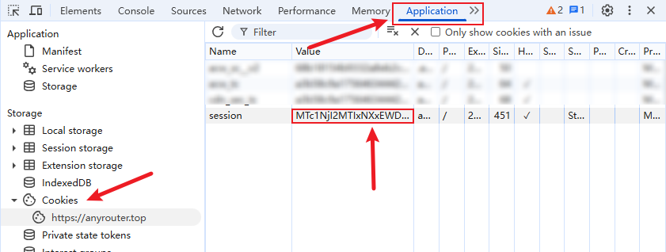
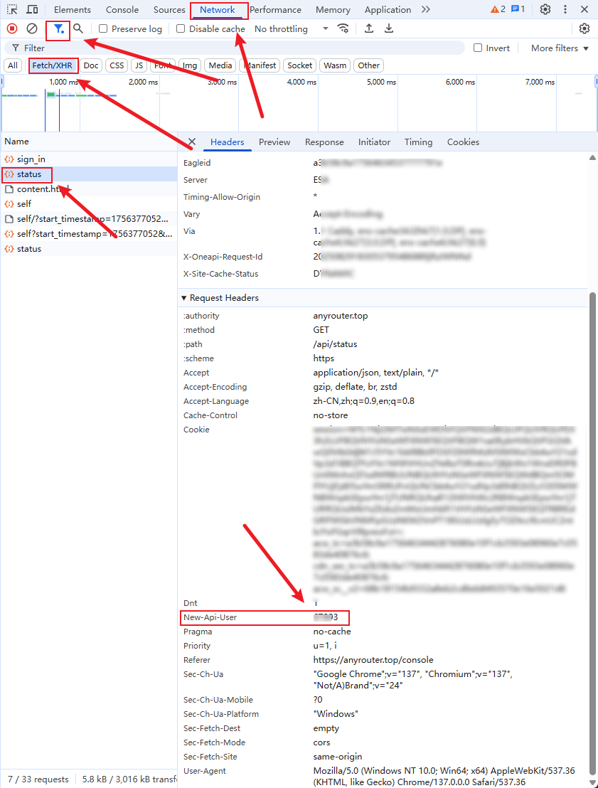

# AnyRouter 青龙自动签到脚本

> 🎯 专为青龙面板优化的 AnyRouter.top 多账号自动签到脚本

这是原 AnyRouter 签到脚本的青龙面板适配版本，支持在青龙面板中定时执行签到任务，一次签到可获得 $25，支持多账号批量操作。

## ✨ 功能特性

- ✅ **多账号支持**: 一次配置，批量签到多个账号
- ✅ **WAF绕过**: 使用 Playwright 自动绕过网站防护
- ✅ **青龙优化**: 专为青龙面板环境优化，无头模式运行
- ✅ **多种通知**: 支持企业微信、钉钉、飞书、PushPlus、Server酱、Telegram
- ✅ **容错处理**: 支持部分账号失败，不影响整体任务执行
- ✅ **详细日志**: 青龙标准格式日志，方便查看执行状态

## 🚀 快速部署

### 1. 上传脚本文件

将以下文件上传到青龙面板的脚本目录 (`/ql/scripts/`)：
- `anyrouter_checkin.py` - 主签到脚本
- `ql_notify.py` - 通知模块
- `requirements.txt` - 依赖文件

### 2. 安装依赖

在青龙面板的「依赖管理」中安装 Python 依赖，或者在容器中执行：

```bash
# 进入青龙容器
docker exec -it qinglong bash

# 安装Python依赖
pip3 install -r /ql/scripts/requirements.txt

# 安装Playwright浏览器
playwright install chromium

# 如果遇到依赖问题，可能需要安装系统依赖
apt-get update && apt-get install -y \
    libglib2.0-0 libnss3 libnspr4 libxss1 libdrm2 \
    libgtk-3-0 libasound2 libxcomposite1 libxdamage1 \
    libxrandr2 libatk1.0-0 libcups2 libatspi2.0-0
```

### 3. 配置账号信息

在青龙面板的「环境变量」中添加：

#### 必需变量
- **变量名**: `ANYROUTER_ACCOUNTS`
- **变量值**: JSON格式的账号配置（见下方格式说明）

#### 账号配置格式

```json
[
  {
    "cookies": {
      "session": "account1_session_value"
    },
    "api_user": "account1_api_user_id"
  },
  {
    "cookies": {
      "session": "account2_session_value"
    },
    "api_user": "account2_api_user_id"
  }
]
```

### 4. 获取账号信息

#### 获取 Session Cookie

1. 使用浏览器访问 [https://anyrouter.top/](https://anyrouter.top/)
2. 登录你的账号
3. 按 `F12` 打开开发者工具
4. 切换到 `Application` 选项卡
5. 在左侧找到 `Cookies` → `https://anyrouter.top`
6. 复制 `session` 的值



#### 获取 API User

1. 在开发者工具中切换到 `Network` 选项卡
2. 过滤显示 `Fetch/XHR` 请求
3. 刷新页面或进行一些操作
4. 找到带有 `new-api-user` 请求头的请求
5. 复制该请求头的值（通常是5位数）



### 5. 配置定时任务

在青龙面板的「定时任务」中添加：

- **任务名称**: `AnyRouter自动签到`
- **命令**: `python3 /ql/scripts/anyrouter_checkin.py`
- **定时规则**: `0 8 * * *` （每天上午8点执行）
- **状态**: 启用

## 📮 通知配置（可选）

在青龙面板的「环境变量」中配置以下变量来启用通知：

### 企业微信机器人
```
WEIXIN_WEBHOOK=https://qyapi.weixin.qq.com/cgi-bin/webhook/send?key=YOUR_KEY
```

### 钉钉机器人
```
DINGDING_WEBHOOK=https://oapi.dingtalk.com/robot/send?access_token=YOUR_TOKEN
```

### 飞书机器人
```
FEISHU_WEBHOOK=https://open.feishu.cn/open-apis/bot/v2/hook/YOUR_HOOK
```

### PushPlus推送
```
PUSHPLUS_TOKEN=YOUR_PUSHPLUS_TOKEN
```

### Server酱
```
SERVERPUSHKEY=YOUR_SENDKEY
```

### Telegram机器人
```
TG_BOT_TOKEN=YOUR_BOT_TOKEN
TG_USER_ID=YOUR_USER_ID
```

## 📋 配置示例

假设你有两个 AnyRouter 账号需要签到：

```json
[
  {
    "cookies": {
      "session": "abc123def456ghi789jkl"
    },
    "api_user": "12345"
  },
  {
    "cookies": {
      "session": "mno456pqr789stu012vwx"
    },
    "api_user": "67890"
  }
]
```

## 📊 执行结果

脚本执行后会显示类似以下的结果：

```
[2024-01-15 08:00:01] [INFO] AnyRouter.top multi-account auto check-in script started (Qinglong Version)
[2024-01-15 08:00:01] [INFO] Found 2 account configurations
[2024-01-15 08:00:02] [INFO] Account 1: Starting browser to get WAF cookies...
[2024-01-15 08:00:15] [SUCCESS] Account 1: Successfully got all WAF cookies
[2024-01-15 08:00:16] [INFO] Account 1: 💰 Current balance: $125.00, Used: $25.50
[2024-01-15 08:00:17] [SUCCESS] Account 1: Check-in successful!
[2024-01-15 08:00:18] [SUCCESS] All accounts check-in successful!
```

## ⚠️ 注意事项

1. **Cookie有效期**: Session cookie 理论上有效期1个月，但可能提前失效，失效时会报401错误，需要重新获取

2. **青龙环境**: 确保青龙面板有足够的系统资源运行 Playwright 浏览器

3. **网络环境**: 脚本需要能够访问 `anyrouter.top`，确保网络畅通

4. **执行频率**: 建议每天执行一次，AnyRouter 的签到是24小时限制，不是按自然日计算

5. **容器权限**: 如果在 Docker 环境中运行，确保容器有足够的权限运行浏览器

## 🔧 故障排除

### 常见问题

1. **安装 Playwright 失败**
   ```bash
   # 手动安装系统依赖
   apt-get update && apt-get install -y wget gnupg
   playwright install-deps
   playwright install chromium
   ```

2. **401 错误**
   - Cookie 过期，需要重新获取 session 值

3. **浏览器启动失败**
   ```bash
   # 检查是否缺少系统依赖
   ldd /root/.cache/ms-playwright/chromium-*/chrome-linux/chrome
   ```

4. **No space left on device**
   - 清理青龙面板日志文件
   - 清理 Playwright 浏览器缓存

### 日志查看

在青龙面板的「任务日志」中查看详细的执行日志，包含：
- 账号处理状态
- Cookie 获取情况
- 签到结果
- 通知发送状态

## 🤝 技术支持

- 原项目地址：[anyrouter-check-in](https://github.com/millylee/anyrouter-check-in)
- AnyRouter 官网：[https://anyrouter.top/](https://anyrouter.top/register?aff=gSsN)

## 📄 免责声明

本脚本仅用于学习和研究目的，使用前请确保遵守相关网站的使用条款。使用本脚本所产生的任何后果由使用者自行承担。